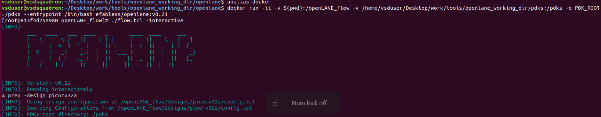
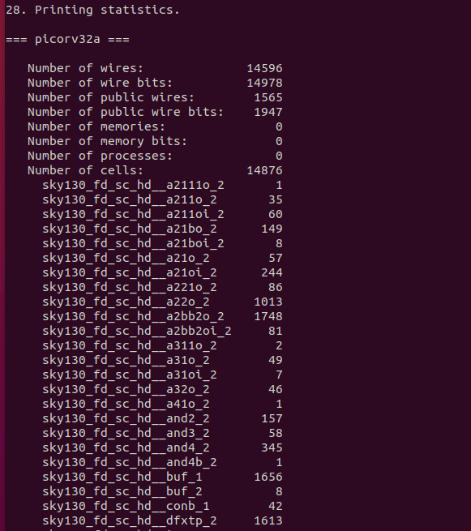
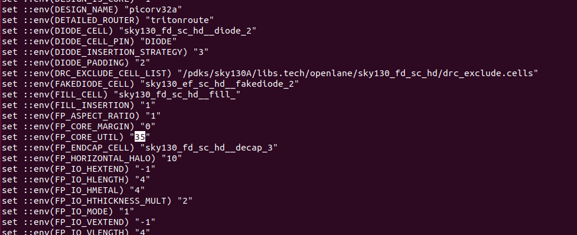
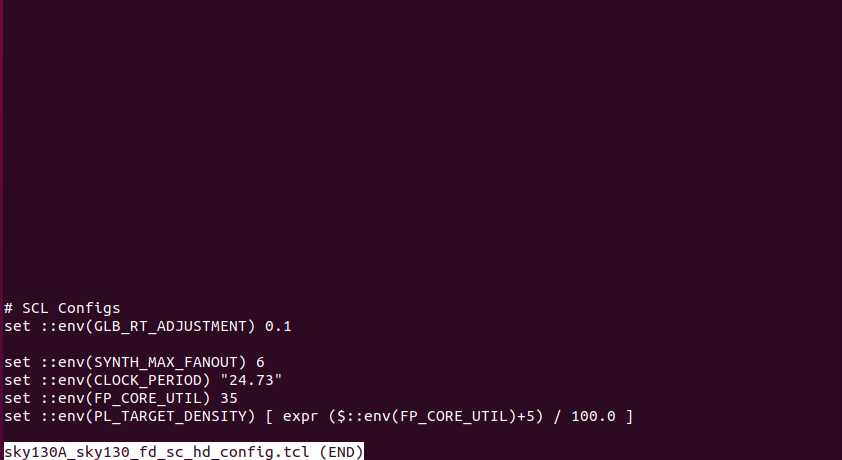
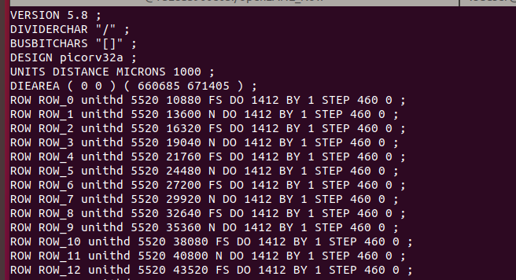

# openlane_sky130_workshop
The OpenLANE SKY130 VSD Workshop is a hands-on workshop for learning complete ASIC physical design flow using open-source VLSI tools and the SKY130 technology.
# Day 1 — Inception of Open-Source EDA, OpenLANE & Sky130 PDK

## Understanding Modern Chip Design

The field of VLSI design focuses on creating highly complex integrated circuits by combining millions of transistors onto a single silicon chip. Traditionally, ASIC development depended heavily on expensive commercial Electronic Design Automation (EDA) tools and proprietary fabrication technologies, limiting access to only large semiconductor companies. With the rise of open-source EDA tools and publicly available Process Design Kits (PDKs), it has now become possible for students, researchers, and hardware enthusiasts to learn and implement complete ASIC design flows using freely accessible resources.

The OpenLANE and Sky130 ecosystem represents one of the biggest milestones in democratizing chip design. It allows designers to move from RTL design all the way to GDSII layout generation using open-source tools and real fabrication technology.

---

## Understanding the QFN-48 Package

When observing an embedded development board or electronic circuit, the visible black component is usually not the actual silicon chip itself. Instead, it is a protective package that contains the silicon die inside it. One commonly used package in ASIC and embedded applications is the **QFN-48 (Quad Flat No-Lead)** package.

The QFN package provides:

- Mechanical protection to the silicon die
- Electrical connections between the chip and PCB
- Better heat dissipation
- Compact size for modern electronic devices

Inside the package, the actual silicon die is mounted at the center. Tiny metallic wires called **bond wires** connect the die pads to the external package pins. These pins allow the chip to communicate with external peripherals, power supplies, clocks, and communication interfaces.

---

## Internal Structure of a Chip

### Pads

Pads are special metallic regions located around the boundary of the silicon die. They serve as communication points between the internal circuitry and the external package pins.

Pads are mainly used for:

- Input signals
- Output signals
- Clock connections
- Power supply connections
- Ground connections

Since pads directly interact with the outside world, they are designed to handle higher voltages and electrostatic discharge protection.

### Core

The central region enclosed by the pads is called the **core**. This is the most important section of the chip because it contains the actual digital logic responsible for computation and data processing.

The core includes:

- Standard cells
- Logic gates
- Arithmetic circuits
- Control units
- Memories
- Processor logic

The performance, power consumption, and area utilization of the chip mainly depend on the core design.

### Die

The complete silicon structure containing both the pads and the core is known as the **die**. The die is manufactured using semiconductor fabrication processes inside specialized factories called foundries.

---

## Foundries and Process Design Kits (PDKs)

A **foundry** is a semiconductor manufacturing facility where integrated circuits are fabricated on silicon wafers. Examples of semiconductor foundries include fabrication companies that manufacture chips for different design organizations.

To manufacture a chip correctly, designers require detailed information about the fabrication technology. This information is provided through a **Process Design Kit (PDK)**.

A PDK contains:

- Design rules
- Standard cell libraries
- Device models
- DRC and LVS rule files
- SPICE models
- Layer information

The **Sky130 PDK** is an open-source 130nm technology node that enables designers to perform real ASIC implementation using publicly available resources.

---

## Intellectual Property (IP) Blocks and Macros

Modern ASICs are extremely complex and are rarely designed completely from scratch. Designers reuse previously verified blocks called **IP blocks (Intellectual Property blocks)** to reduce development time and improve reliability.

Examples of IP blocks include:

- SRAM memories
- PLLs
- UART controllers
- SPI interfaces
- USB controllers
- Processor cores

Some IPs are process-dependent and are known as **Foundry IPs** because they are tightly linked to fabrication technology.

Digital reusable blocks are often referred to as **macros**. These macros help designers integrate large functionalities into System-on-Chip (SoC) architectures efficiently.

---

## Introduction to RISC-V Architecture

RISC-V is an open-source Instruction Set Architecture (ISA) developed to provide a flexible and license-free processor architecture. Unlike proprietary ISAs, RISC-V allows designers to customize and extend processor functionality according to application requirements.

The ISA defines:

- Supported instructions
- Register organization
- Memory access methods
- Arithmetic operations
- Control flow operations

RISC-V has become highly popular in academic research, processor development, and open-hardware communities because of its modular and open nature.

---

## From Software Applications to Hardware

A software program written in a high-level language such as C undergoes multiple transformation stages before it can execute on hardware.

### Software-to-Hardware Flow

1. The C program is compiled into RISC-V assembly instructions.
2. The assembler converts assembly instructions into binary machine code.
3. The processor hardware interprets and executes the binary instructions.
4. The processor itself is implemented using RTL design.
5. RTL is synthesized into logic gates.
6. The physical design flow converts the logic into a manufacturable chip layout.

This complete transformation creates a bridge between software applications and physical silicon implementation.

---

## RTL Design and Hardware Description Languages

RTL (Register Transfer Level) design describes hardware behavior using Hardware Description Languages (HDLs) such as Verilog or VHDL.

RTL design defines:

- Data movement
- Clock behavior
- Sequential logic
- Combinational logic
- Register operations

RTL acts as the foundation of digital hardware design because it represents the functional behavior of the circuit before physical implementation begins.

---

## OpenLANE ASIC Flow

OpenLANE is an automated open-source RTL-to-GDSII ASIC implementation flow built around the Sky130 PDK. It integrates multiple open-source EDA tools into a unified workflow.

### Major Stages of OpenLANE Flow

- RTL synthesis
- Floorplanning
- Power planning
- Placement
- Clock Tree Synthesis (CTS)
- Routing
- Timing analysis
- Physical verification
- GDSII generation

The flow converts a Verilog RTL design into a final physical layout that can be fabricated on silicon.

---

## Open-Source EDA Tools Used in the Flow

The OpenLANE ecosystem use several important open-source tools:
- **Yosys** → RTL synthesis
- **OpenROAD** → Physical design automation
- **Magic** → Layout visualization and DRC
- **Netgen** → LVS verification
- **TritonRoute** → Detailed routing

These tools collectively provide a complete ASIC implementation environment without requiring expensive commercial software licenses.

---

## Importance of Open-Source ASIC Design

The availability of open-source EDA tools and PDKs has significantly transformed VLSI education and research. Students and engineers can now learn real industrial ASIC flows without depending on proprietary resources.

Benefits include:

- Low-cost learning environment
- Industry-level practical exposure
- Better understanding of physical design
- Faster research and innovation
- Community-driven development

The combination of OpenLANE, RISC-V, and Sky130 represents a major advancement toward accessible and collaborative silicon development.
Lab For picorv32a
```bash
cd /Desktop/work/tools/openlane_working_dir/openLane
./flow.tcl -interactive
package require openlane 9.0
```

Flop Ratio = total numbers of d flip-flop/total number of cells
Flop Ratio for picorv32a is 1613/14876=0.108... = 10.8%

# Day 2 — Good Floorplan vs Bad Floorplan and Introduction to Library Cells

# Module 1 — Chip Floor Planning Considerations

## Introduction to Floorplanning

Floorplanning is an important stage in ASIC physical design where the overall structure of the chip is defined before placement and routing. It determines the core area, pin locations, macro positions, and power distribution of the chip. A good floorplan improves routing efficiency, timing performance, and power integrity, while a poor floorplan can create congestion and timing issues.

---

## Utilization Factor and Aspect Ratio

The utilization factor defines how much of the core area is occupied by standard cells.

:contentReference[oaicite:0]{index=0}

Very high utilization can cause routing congestion, while very low utilization wastes chip area.

The aspect ratio defines the ratio between the height and width of the core.

:contentReference[oaicite:1]{index=1}

A balanced aspect ratio helps achieve better routing and timing performance.

---

## Concept of Pre-Placed Cells

Large blocks such as SRAMs, PLLs, and analog IPs are called pre-placed cells or macros. These blocks are fixed before standard cell placement begins. Proper macro placement is important because it directly affects routing congestion and timing.

---

## De-Coupling Capacitors

De-coupling capacitors are used to reduce voltage fluctuations caused by switching activity inside the chip. They help maintain stable power supply levels and improve chip reliability.

Benefits include:

- Reduced power noise
- Improved voltage stability
- Better signal integrity

---

## Power Planning

Power planning creates the power distribution network of the chip using power rails, rings, and straps. A good power plan reduces IR drop and ensures stable power delivery across the chip.

---

## Pin Placement and Placement Blockage

Pins are placed around the boundary of the chip for external communication. Proper pin placement reduces wirelength and routing complexity.

Placement blockages are restricted regions where cells cannot be placed. These blockages help reserve routing space and reduce congestion.
core utilization defined in config.tcl file

core utilization defined in sky130....tcl file(which has highest priority)


Die-area (0 0) ( 660685 671405) 
Width  = 660685 / 1000 = 660.685 µm
Height = 671405 / 1000 = 671.405 µm
Area = 660.685 × 671.405
     = 443540.788425 µm²
Die Area = 0.4435 mm²


# Module 2 — Library Binding and Placement Optimization

## Introduction to Library Binding

After floorplanning, the synthesized netlist must be connected with the standard cell libraries available in the technology. This process is called **library binding**. During this stage, logical cells from synthesis are mapped to physical cells that exist inside the Sky130 standard cell library.

Library binding ensures:

- Correct physical implementation
- Timing-aware optimization
- Power optimization
- Area-efficient placement

---

## Netlist Binding and Initial Placement

The synthesized netlist is converted into a physical representation by assigning actual standard cells to each logical function. Initial placement arranges cells inside the core while maintaining connectivity and reducing wirelength.

The objectives are:

- Minimize cell overlap
- Reduce total wirelength
- Improve timing performance

---

## Placement Optimization

Placement optimization improves the initial placement by moving cells to achieve better timing and lower congestion.

Optimization focuses on:

- Reducing setup violations
- Improving signal delay
- Lowering power consumption
- Minimizing routing difficulty

Multiple optimization iterations may be performed before final placement.

---

## Need for Libraries

Standard cell libraries are collections of pre-designed and pre-characterized digital cells.

Examples include:

- NAND gates
- NOR gates
- Buffers
- Inverters
- Flip-flops

Libraries contain:

- Functional information
- Timing data
- Power characteristics
- Physical dimensions

These libraries allow faster and more reliable chip implementation.

---

## Congestion Aware Placement

Congestion occurs when routing demand exceeds available routing resources.

Congestion-aware placement attempts to:

- Spread cells evenly
- Reduce routing blockage
- Maintain timing performance
- Improve routing success

Proper congestion control results in cleaner and more efficient layouts.

---

# Module 3 — Cell Design and Characterization Flow

## Introduction to Cell Design

Cell design focuses on creating individual standard cells used throughout the ASIC.

Each standard cell must satisfy:

- Functional correctness
- Area requirements
- Timing constraints
- Power targets

Cell design directly influences final chip performance.

---

## Inputs for Cell Design Flow

Cell development begins with several required inputs:

- Technology files
- Design rules
- Electrical constraints
- Library specifications

These inputs define how the physical cell should be implemented.

---

## Circuit Design Step

In this stage, transistor-level circuits are designed to implement required logic behavior.

The circuit design process includes:

- Transistor sizing
- Power analysis
- Delay optimization
- Functional verification

Simulation tools verify the operation before layout generation.

---

## Layout Design Step

Layout design converts transistor schematics into physical geometry.

Layout generation includes:

- Transistor placement
- Metal routing
- Layer creation
- DRC compliance

The generated layout must satisfy manufacturing rules.

---

## Typical Characterization Flow

After layout completion, characterization is performed.

Characterization extracts:

- Propagation delay
- Setup time
- Hold time
- Power consumption

The generated data becomes part of the standard cell library used during synthesis and implementation.

---

# Module 4 — General Timing Characterization Parameters

## Introduction to Timing Parameters

Timing characterization determines how quickly signals move through digital circuits and whether data remains stable.

Timing analysis is essential for reliable ASIC operation.

---

## Timing Threshold Definitions

Timing thresholds define the reference points used to measure signal transitions.

Important timing thresholds include:

- Rise threshold
- Fall threshold
- Input threshold
- Output threshold

These thresholds are used to calculate accurate delays.

---

## Propagation Delay

Propagation delay is the time required for a signal to travel from input to output.

It is represented as:

:contentReference[oaicite:0]{index=0}

Lower propagation delay improves circuit speed.

---

## Setup Time and Hold Time

Setup time is the minimum duration data must remain stable before the clock edge.

Hold time is the minimum duration data must remain stable after the clock edge.

These parameters are critical for avoiding timing violations.

---

## Rise Time and Fall Time

Rise time measures the transition from logic 0 to logic 1.

Fall time measures the transition from logic 1 to logic 0.

These values affect:

- Switching speed
- Power consumption
- Signal quality

Accurate timing characterization ensures reliable standard cell operation during ASIC implementation.
# Day 3 — Design Library Cell using Magic Layout and ngspice Characterization

# Module 1 — Labs for CMOS Inverter using ngspice

## Introduction

This module introduces the practical implementation and simulation of a CMOS inverter using ngspice. The objective is to understand transistor-level behavior, SPICE simulation flow, switching characteristics, and performance analysis of CMOS circuits.

---

## SPICE Deck Creation

A SPICE deck contains circuit description, device models, simulation commands, and analysis setup. It is used to simulate transistor operation and verify circuit behavior before layout implementation.

---

## CMOS Inverter Simulation

The CMOS inverter is simulated to observe input-output characteristics and switching operation. Simulation helps evaluate functionality, output transitions, and voltage behavior.

---

## Switching Threshold (Vm)

Switching threshold voltage is the point where input voltage becomes equal to output voltage during transition.

It determines:

- Noise margin
- Switching speed
- Stable logic operation

---

## Static and Dynamic Simulation

Static simulation observes DC characteristics while dynamic simulation evaluates transient behavior and switching response over time.

---

# Module 2 — Inception of Layout and CMOS Fabrication Process

## Introduction

This module explains how transistor circuits are physically implemented on silicon using fabrication and layout techniques.

---

## Active Region Formation

Active regions define locations where transistors are created and electrical conduction occurs.

---

## N-Well and P-Well Formation

Wells are created to support PMOS and NMOS transistor construction inside the silicon substrate.

---

## Gate Formation

The gate terminal controls transistor switching and determines device operation.

---

## Source and Drain Formation

Source and drain regions are formed through doping processes to enable current flow.

---

## Local Interconnect and Metal Layers

Metal layers provide electrical connectivity between devices and allow implementation of complete circuits.

---

## Standard Cell Creation

All layout structures are combined to create reusable standard cells for digital design.

---

# Module 3 — Sky130 Tech File and Characterization

## Introduction

Technology files define manufacturing rules and physical information required for layout and verification.

---

## Final Standard Cell Creation

The completed layout is verified and prepared for characterization.

---

## Cell Characterization

Characterization extracts:

- Delay information
- Power consumption
- Timing parameters
- Switching behavior

---

## Introduction to Magic and Sky130

Magic is used for layout visualization and verification, while Sky130 provides the fabrication technology information required for implementation.
# Day 4 — Pre-layout Timing Analysis and Clock Tree Synthesis

# Module 1 — Timing Modelling using Delay Tables

## Introduction

Timing modelling predicts circuit behavior before physical implementation and helps estimate performance.

---

## Timing Parameters

Important timing parameters include:

- Delay
- Slew
- Rise time
- Fall time

---

## Delay Tables

Delay tables store timing information for different loading and transition conditions.

---

## Timing Configuration

Timing configuration ensures accurate analysis and optimization during implementation.

---

# Module 2 — Timing Analysis and Clock Introduction

## Introduction

Timing analysis verifies whether signals arrive within required timing constraints.

---

## Setup Timing Analysis

Setup analysis ensures data arrives before the active clock edge.

---

## Clock Jitter

Clock jitter represents unwanted clock variation that may affect timing performance.

---

## Timing Optimization

Timing optimization reduces violations and improves performance.

---

# Module 3 — Clock Tree Synthesis (CTS)

## Introduction

Clock Tree Synthesis distributes clock signals across the chip while minimizing skew and delay.

---

## Clock Routing

Clock routing creates balanced paths between clock source and sequential elements.

---

## Crosstalk and Clock Network

Crosstalk affects signal integrity and must be controlled for reliable operation.

---

## CTS Verification

Clock tree results are verified to ensure timing and clock quality.

---

# Module 4 — Timing Analysis after CTS

## Introduction

Post-CTS timing analysis validates timing performance after clock implementation.

---

## Setup Analysis

Checks whether setup constraints are satisfied.

---

## Hold Analysis

Ensures data remains stable after clock transition.

---

## Timing Closure

Timing closure removes all timing violations before routing.
# Day 5 — Final Steps for RTL2GDS Flow

# Module 1 — Routing and Design Rule Check

## Introduction

Routing creates physical wire connections between placed cells and completes circuit implementation.

---

## Maze Routing

Maze routing determines valid paths while avoiding obstacles.

---

## Lee's Algorithm

Lee's algorithm is used to find shortest routing paths systematically.

---

## Design Rule Check (DRC)

DRC verifies that layout follows fabrication design rules.

---

# Module 2 — Power Distribution and Routing

## Introduction

Power distribution ensures stable voltage delivery across the chip.

---

## Power Planning

Power rails and power networks are generated for reliable operation.

---

## Global and Detailed Routing

Global routing plans paths, while detailed routing creates exact physical connections.

---

# Module 3 — TritonRoute Features

## Introduction

TritonRoute performs detailed routing inside OpenLANE.

---

## Routing Features

TritonRoute supports:

- Detailed routing
- DRC fixing
- Routing optimization
- Layer management

---

## Routing Methodology

Routing algorithms generate efficient interconnections while minimizing congestion.

---

## Final Verification

After routing completion, final verification ensures the layout is ready for GDS generation and fabrication.
